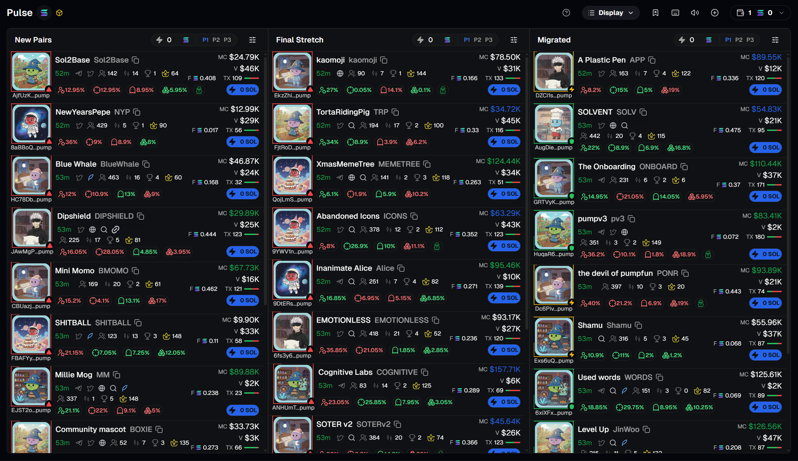
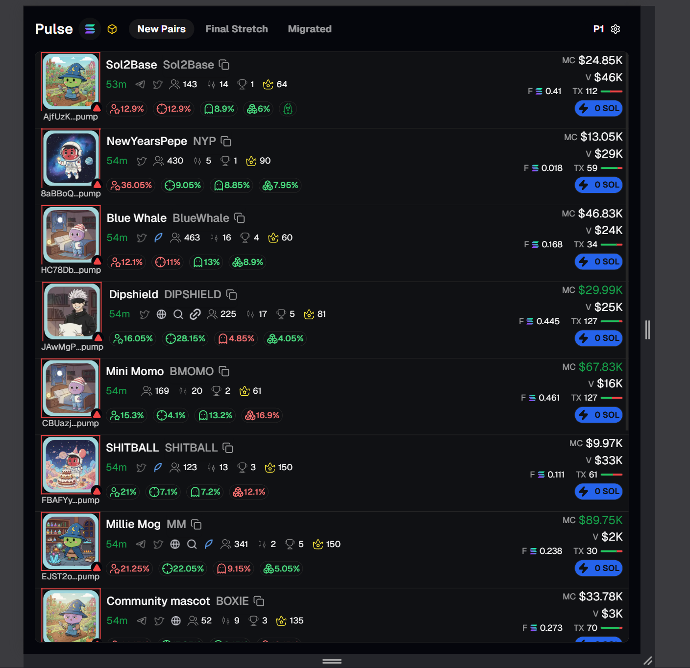
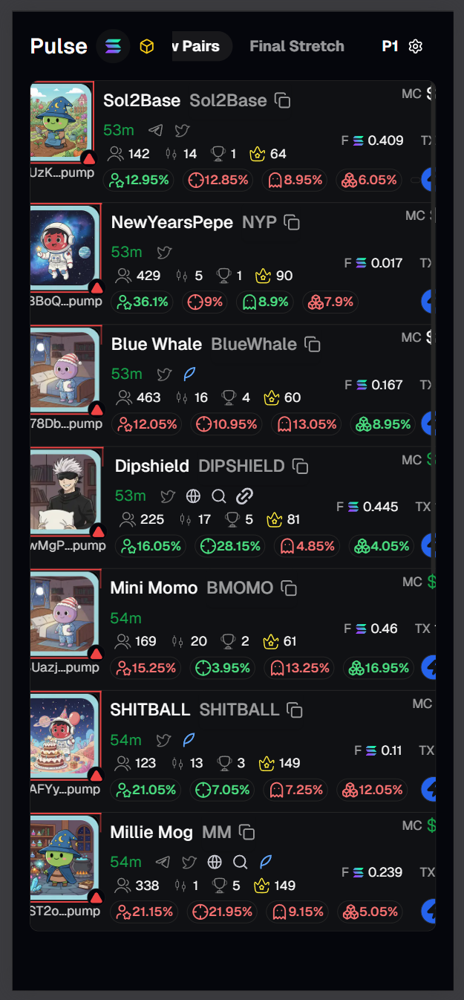

# Pulse - Next.js Trading Dashboard

Pulse is a high-performance trading dashboard built with Next.js, styled with TailwindCSS, and powered by Redux-Toolkit for robust state management.

## Getting Started

First, run the development server:

```bash
npm run dev
```

Open [http://localhost:3000](http://localhost:3000) with your browser to see the result.

## Technical Stack

### Core Technologies

- **Next.js 14**: App Router, Server Components, Image Optimization
- **TypeScript (Strict Mode)**: Full type safety, no `any` types
- **Tailwind CSS**: Utility-first styling, responsive design
- **React 18**: Concurrent features, automatic batching

### State Management

- **Redux Toolkit**: Slice pattern, entity adapter, Immer integration
- **React-Redux**: Hooks-based API (`useAppSelector`, `useAppDispatch`)

### UI Components

- **Radix UI**: Accessible primitives (Dialog, Tooltip, Tabs)
- **shadcn/ui**: Pre-built components on top of Radix
- **Lucide React**: Icon library (tree-shakeable)
- **Sonner**: Toast notifications

### Development Tools

- **ESLint**: Code quality enforcement
- **Playwright**: Visual regression testing
- **Git**: Version control with clean commit history

### Performance Features

- **Memoization**: `React.memo`, `useMemo`, `useCallback`
- **Entity Normalization**: Redux Toolkit entity adapter
- **Batch Updates**: Efficient Redux dispatches
- **Skeleton Loaders**: Progressive loading states
- **CSS Animations**: GPU-accelerated transitions

### Code Quality

- **Comprehensive Typing**: All components, hooks, and utilities typed
- **Error Handling**: Toast notifications for user feedback
- **Documented Logic**: Complex algorithms explained (Fisher-Yates shuffle, entity adapter)
- **DRY Principles**: Reusable components, shared utilities, configuration arrays

## Responsive Design (320px - ∞)

The application is **fully responsive** with carefully crafted layouts that adapt seamlessly from ultra-wide monitors down to 320px mobile devices.

### Responsive Breakpoints

The layout uses **Tailwind's default breakpoints** with custom responsive patterns:

**Desktop View - 3 Column Layout**


**Tablet View - Single Column**


**Mobile View - 320px Width**


### Layout Adaptations

**Desktop (≥1024px)**: 3-Column Grid

```tsx
// Each tab (New Pairs, Final Stretch, Migrated) gets its own column
<div className="grid grid-cols-3 gap-4">
  <Tab name="New Pairs" />
  <Tab name="Final Stretch" />
  <Tab name="Migrated" />
</div>
```

**Tablet (768px - 1023px)**: Single Column with Tabs

- Horizontal tab navigation at the top
- One active column visible at a time
- Smooth tab switching with Redux state management

**Mobile (320px - 767px)**: Optimized Single Column

- Compact token rows with adjusted spacing
- Responsive typography (text scales down appropriately)
- Touch-friendly interactive elements (larger tap targets)
- Horizontal scrolling for wide content (badges, metrics)

### Responsive Patterns Used

**1. Conditional Rendering**:

```tsx
// Hide table header on mobile, show on desktop
<div className="flex-shrink-0 hidden lg:block">
  <TabHeader name={name} number={number} />
</div>
```

**2. Responsive Spacing**:

```tsx
// Adjust padding/gaps based on screen size
<div className="gap-2 lg:gap-4 p-2 lg:p-4">
```

**3. Flexible Layouts**:

```tsx
// Flexbox that wraps on smaller screens
<div className="flex flex-wrap lg:flex-nowrap">
```

**4. Responsive Grid**:

```tsx
// 1 column on mobile, 3 on desktop
<div className="grid grid-cols-1 lg:grid-cols-3">
```

### No Layout Shifts

- **Fixed Heights**: Skeleton loaders match exact component dimensions
- **Aspect Ratios**: Images use Next.js `width`/`height` props
- **Pre-allocated Space**: All dynamic content has placeholder states
- **CSS Grid/Flexbox**: Prevents reflow during data loading

## Separation of Concerns

The codebase follows strict **separation of concerns** with clear boundaries between different layers:

### 1. **Presentation Layer** (Components)

- **Location**: `src/components/`
- **Responsibility**: UI rendering, user interactions, visual presentation
- **No Business Logic**: Components receive data via props, don't compute it
- **Example**: `TokenCapItem` displays a metric but doesn't calculate it

### 2. **State Management Layer** (Redux)

- **Location**: `src/lib/features/`
- **Responsibility**: Application state, data transformations, business logic
- **Slices**:
  - `presetsSlice`: Trading configuration logic
  - `tokensSlice`: Token data normalization and updates
  - `uiSlice`: UI state (active tab, modals, etc.)

### 3. **Data Layer** (Interfaces & Types)

- **Location**: `src/lib/interface/`
- **Responsibility**: Type definitions, data contracts
- **Files**:
  - `tokens.ts`: Token schema and related types
  - `types.ts`: Preset settings, UI state types

### 4. **Business Logic Layer** (Hooks & Utils)

- **Location**: `src/hooks/`, `src/lib/utils.ts`
- **Responsibility**: Reusable logic, side effects, data fetching
- **Example**: `useWebSocketMock` handles real-time data simulation

### 5. **Configuration Layer**

- **Location**: `src/components/.../constants/`
- **Responsibility**: Static configuration, constants, mappings
- **Example**: `socialIcons.ts` - Social media icon configuration array

### Separation Example: Token Display Flow

```
1. Data Layer (tokens.ts)
   └─> Defines Token interface

2. State Layer (tokensSlice.ts)
   └─> Manages token state with entity adapter
   └─> Provides selectors (selectAllTokens)

3. Business Logic (useWebSocketMock)
   └─> Simulates real-time updates
   └─> Dispatches updateTokens action

4. Presentation (TabRow.tsx)
   └─> Receives token via props
   └─> Renders UI components
   └─> No state management, pure presentation

5. Configuration (socialIcons.ts)
   └─> Provides icon mappings
   └─> Consumed by TokenSocials component
6. Types (types.ts)
   └─> Defines types interfaces

```

**Benefits**:

- **Testability**: Each layer can be tested independently
- **Maintainability**: Changes in one layer don't affect others
- **Scalability**: Easy to add new features without refactoring
- **Reusability**: Components/hooks can be reused across the app

## 📁 Project Structure

This project follows a modular and scalable folder structure:

```text
pulse/
├── src/
│   ├── app/                          # Next.js App Router
│   │   ├── fonts/                    # Custom font files
│   │   ├── favicon.ico               # App favicon
│   │   ├── globals.css               # Global styles
│   │   ├── layout.tsx                # Root layout
│   │   ├── page.tsx                  # Home page
│   │   └── StoreProvider.tsx         # Redux store provider
│   │
│   ├── components/                   # UI Component Library
│   │   ├── app-components/           # Feature-specific components
│   │   │   ├── ComonComponents/      # Shared common components
│   │   │   │   ├── CustomBadge.tsx
│   │   │   │   ├── MenubarItem.tsx
│   │   │   │   ├── Navbar.tsx
│   │   │   │   ├── Seperator.tsx
│   │   │   │   ├── Toaster.tsx
│   │   │   │   ├── WalletBadge.tsx
│   │   │   │   └── interface/
│   │   │   │
│   │   │   ├── MobileComponents/     # Mobile-specific components
│   │   │   │
│   │   │   ├── PopUpComponents/      # Modal and popup components
│   │   │   │   ├── AutoFee.tsx
│   │   │   │   ├── BuyOrSellTab.tsx
│   │   │   │   ├── MaxFee.tsx
│   │   │   │   ├── MevMode.tsx
│   │   │   │   ├── PopUpHeader.tsx
│   │   │   │   ├── PresetPopup.tsx
│   │   │   │   ├── TradeParameterInput.tsx
│   │   │   │   ├── TradingSettingsPopUp.tsx
│   │   │   │   └── interface/
│   │   │   │
│   │   │   ├── TableComponents/      # Table and row components
│   │   │   │   ├── TabRowComponents/ # Token row components
│   │   │   │   │   ├── CommonComponents/
│   │   │   │   │   ├── Skeletons/    # Loading skeletons
│   │   │   │   │   ├── TokenComponents/  # Token-specific UI
│   │   │   │   │   ├── Tooltip/
│   │   │   │   │   ├── TabRow.tsx
│   │   │   │   │   └── interface/
│   │   │   │   │
│   │   │   │   ├── TableHeaderComponents/  # Table header components
│   │   │   │   │   ├── TabFilterAction.tsx
│   │   │   │   │   ├── TabHeader.tsx
│   │   │   │   │   ├── TabPresets.tsx
│   │   │   │   │   ├── TabPresetsContent.tsx
│   │   │   │   │   ├── TabStats.tsx
│   │   │   │   │   └── TabTitle.tsx
│   │   │   │   │
│   │   │   │   ├── Tab.tsx
│   │   │   │   └── interface/
│   │   │   │
│   │   │   └── TokenTable.tsx        # Main table component
│   │   │
│   │   ├── ui/                       # Shadcn UI Components
│   │   │   ├── badge.tsx
│   │   │   ├── button.tsx
│   │   │   ├── checkbox.tsx
│   │   │   ├── dialog.tsx
│   │   │   ├── input-group.tsx
│   │   │   ├── input.tsx
│   │   │   ├── label.tsx
│   │   │   ├── menubar.tsx
│   │   │   ├── separator.tsx
│   │   │   ├── sonner.tsx
│   │   │   ├── table.tsx
│   │   │   ├── tabs.tsx
│   │   │   ├── textarea.tsx
│   │   │   └── tooltip.tsx
│   │   │
│   │   ├── next-components/          # Next.js-specific components
│   │   └── SocketInitializer.tsx     # WebSocket initialization
│   │
│   ├── hooks/                        # Custom React hooks
│   │   └── useWebSocketMock.ts       # WebSocket mock hook
│   │
│   └── lib/                          # Core Application Logic
│       ├── features/                 # Redux Toolkit Slices
│       │   ├── presets/              # Preset state management
│       │   ├── tokens/               # Token state management
│       │   └── ui/                   # Tab state management
│       │
│       ├── interface/                # TypeScript Type Definitions
│       ├── mock/                     # Mock data for development
│       ├── hooks.ts                  # Typed Redux Hooks
│       ├── store.ts                  # Root Store Configuration
│       └── utils.ts                  # Utility Functions
│
├── public/                           # Static Assets
│   ├── *.svg                         # Icon files (social, badges, etc.)
│   └── pp*.png                       # Profile pictures
│
├── tests/                            # Test Files
│   ├── example.spec.ts               # Example test
│   ├── visual-regression.spec.ts     # Visual regression tests
│   └── visual-regression.spec.ts-snapshots/
│
├── .next/                            # Next.js build output
├── node_modules/                     # Dependencies
├── playwright-report/                # Playwright test reports
├── test-results/                     # Test results
│
├── .env                              # Environment variables
├── .eslintrc.json                    # ESLint configuration
├── .gitignore                        # Git ignore rules
├── components.json                   # Shadcn components config
├── next.config.mjs                   # Next.js configuration
├── package.json                      # Project dependencies
├── playwright.config.ts              # Playwright test config
├── postcss.config.mjs                # PostCSS configuration
├── tailwind.config.ts                # Tailwind CSS configuration
├── tsconfig.json                     # TypeScript configuration
└── README.md                         # Project documentation
```

## State Management (Redux-Toolkit)

The application uses **Redux-Toolkit** to manage complex trading configurations and real-time token data. The state is organized into three domain-specific slices:

### Redux Slices Architecture

#### 1. **Presets Slice** (`presetsSlice.ts`)

Manages trading preset configurations (P1, P2, P3) with independent settings for each preset.

- **Normalized Structure**: `presets: Record<string, PresetSettings>` allows O(1) access to any preset
- **Actions**: `updatePresetSettings` for atomic updates
- **Use Case**: Users can configure different trading strategies per preset (slippage, priority, bribe, MEV mode)

#### 2. **Tokens Slice** (`tokensSlice.ts`) - The Core Data Layer

Manages the real-time token data using **Entity Normalization** via `createEntityAdapter`.

**Why Entity Adapter?**

- **Normalized Schema**: Tokens are stored as `{ ids: string[], entities: Record<string, Token> }` instead of arrays
- **Performance**: O(1) lookups by token address instead of O(n) array searches
- **Efficient Updates**: Batch updates via `updateTokens` only modify changed fields
- **Auto-Sorting**: Tokens automatically sorted by `createdAt` (newest first)

**Key Actions**:

- `setTokens`: Initialize with seed data
- `addToken`: Add new token to the normalized state
- `updateToken`: Update single token by ID
- `updateTokens`: Batch update multiple tokens (used for real-time simulation)

**Selectors**:

- `selectAllTokens`: Returns denormalized array of all tokens (sorted)
- `selectTokenByAddress`: O(1) lookup by token address
- `selectTokenIds`: Returns array of all token IDs

#### 3. **UI Slice** (`uiSlice.ts`)

Manages UI-specific state like the currently active tab ("New Pairs", "Final Stretch", "Migrated").

### Schema Design: Token Type as Database Schema

The `Token` interface in [`tokens.ts`](file:///e:/CODING/06_Personal%20Builds/19_Pulse/pulse/src/lib/interface/tokens.ts) is designed like a **database schema** with clear separation of concerns:

```typescript
interface Token {
  // Primary Key
  id: string;  // Token address (unique identifier)

  // Status & Identity (Categorical Data)
  status1: "New Pairs" | "Final Stretch" | "Migrated";
  status2: "Migrating" | "Idle";
  status3: "Risk" | "Safe" | "Migrated";

  // Real-time Market Data (Frequently Updated)
  marketCap: number;
  volume: number;
  transactions: { buys: number; sells: number };
  bondingValue: number;
  globalFees: number;

  // Holder Metrics (Slowly Changing Dimensions)
  holdersCount: number;
  proTradersCount: number;
  kolsCount: number;

  // Holdings Distribution (Percentage Data)
  bundleHolding: number;
  insiderHolding: number;
  sniperHolding: number;
  devHolding: number;

  // Visualization Data (Complex Nested Structure)
  bubbleMapData: BubblePoint[];

  // Boolean Flags (Feature Toggles)
  socials: { telegram: boolean; x: boolean; ... };
  userIcons: { single: boolean; double: boolean };

  // Temporal Data
  createdAt: number;  // Timestamp for age calculation
}
```

**Design Analogy**:

- **Primary Key**: `id` (token address) - unique identifier for normalization
- **Indexed Fields**: `status1` used for filtering/grouping by tab
- **Hot Data**: Market metrics updated frequently (every 400-1500ms)
- **Cold Data**: Identity fields (name, symbol) never change
- **Computed Fields**: Age calculated from `createdAt` in UI components

### Real-Time Updates Simulation

The [`useWebSocketMock`](file:///e:/CODING/06_Personal%20Builds/19_Pulse/pulse/src/hooks/useWebSocketMock.ts) hook simulates live market data updates:

**Update Flow**:

1. **Initialization**: Dispatch `setTokens(generateSeedTokens())` to populate initial state
2. **Simulation Loop**: Every 400-1500ms (random jitter to mimic network latency)
3. **Batch Updates**: Select 1-3 random tokens and dispatch `updateTokens([...])` with delta changes
4. **Partial Updates**: Only changed fields are updated (Redux Toolkit merges changes automatically)

**Update Strategy**:

```typescript
// Market Cap: Random walk (+/- 50)
marketCap: token.marketCap + (Math.random() > 0.5 ? 1 : -1) * (Math.random() * 50)

// Transactions: Probabilistic increments
transactions: {
  buys: token.transactions.buys + (isBuy ? 1 : 0),
  sells: token.transactions.sells + (!isBuy ? 1 : 0)
}

// Holdings: Small percentage fluctuations (±0.05%)
bundleHolding: Math.min(100, Math.max(0, val + (Math.random() > 0.5 ? 0.05 : -0.05)))

// Bubble Map: Smooth position changes (±0.2 units)
bubbleMapData: points.map(p => ({ ...p, x: p.x + (Math.random() * 0.4 - 0.2) }))
```

**Why This Approach?**

- **Realistic Behavior**: Random intervals + probabilistic updates mimic real market volatility
- **Performance**: Batch updates reduce Redux dispatches (1 action for 3 tokens vs 3 actions)
- **Immutability**: Redux Toolkit's Immer handles immutable updates automatically

### Seed Data Generation Strategy

The [`seedData.ts`](file:///e:/CODING/06_Personal%20Builds/19_Pulse/pulse/src/lib/mock/seedData.ts) file generates realistic initial token data:

**Data Sources**:

- **Real Tokens**: 32 actual Solana tokens with real addresses and base market caps
- **Randomization**: All other fields generated using controlled randomness

**Randomization Techniques**:

1. **Uniform Distribution** (`getRandomInt(min, max)`):

   - `bondingValue`: 20-95%
   - `holdersCount`: 50-500
   - `transactions.buys`: 10-100

2. **Categorical Distribution** (based on index):

   ```typescript
   // Distribute tokens across 3 status categories
   if (index > length / 3) status1 = "Final Stretch";
   if (index > (2 * length) / 3) status1 = "Migrated";
   ```

3. **Conditional Randomness**:

   ```typescript
   // Border color depends on status
   borderColor = status1 === "Migrated" ? "yellow" : (Math.random() > 0.7 ? "red" : "green");

   // Socials: Different probabilities per platform
   telegram: Math.random() > 0.5,  // 50% chance
   x: Math.random() > 0.4,         // 60% chance
   pin: Math.random() > 0.9        // 10% chance (rare)
   ```

4. **Complex Data Structures**:

   ```typescript
   // Generate 15 random bubble points with RGBA colors
   bubbleMapData: Array.from({ length: 15 }, () => ({
     x: getRandomInt(0, 100),
     y: getRandomInt(0, 100),
     r: getRandomInt(2, 10),
     color: `rgba(${getRandomInt(0, 255)}, ${getRandomInt(
       0,
       255
     )}, ${getRandomInt(0, 255)}, ${getRandomInt(0.6, 1)})`,
   }));
   ```

5. **Temporal Randomness**:
   ```typescript
   // Birth time: 2-120 seconds ago
   createdAt: Date.now() - getRandomInt(2000, 120000);
   ```

**Result**: Each token has unique, realistic-looking data that creates a convincing trading dashboard experience.

## Component Architecture

The application follows **Atomic Design principles** with a focus on **composition**, **reusability**, and **prop-driven flexibility**. Components are broken down into their smallest functional units and composed together to build complex UIs.

### GenericTooltip: The Universal Wrapper Pattern

Since tooltips are heavily used throughout the application, a [`GenericTooltip`](file:///e:/CODING/06_Personal%20Builds/19_Pulse/pulse/src/components/app-components/TableComponents/TabRowComponents/Tooltip/GenericTooltip.tsx) component was created to wrap any React component as a trigger and display custom content on hover.

**Interface**:

```typescript
interface GenericTooltipProps {
  trigger: React.ReactNode; // Any component to wrap
  content: React.ReactNode; // Tooltip content
  triggerClassName?: string; // Custom trigger styles
  contentClassName?: string; // Custom content styles
  side?: "top" | "right" | "bottom" | "left";
  align?: "start" | "center" | "end";
}
```

**Implementation**:

```tsx
export function GenericTooltip({
  trigger,
  content,
  triggerClassName,
  contentClassName,
  side = "bottom",
  align = "center",
}: GenericTooltipProps) {
  return (
    <Tooltip>
      <TooltipTrigger asChild className={cn(triggerClassName)}>
        {trigger}
      </TooltipTrigger>
      <TooltipContent
        side={side}
        align={align}
        className={cn("bg-badges", contentClassName)}
      >
        {content}
      </TooltipContent>
    </Tooltip>
  );
}
```

**Why This Pattern?**

- **DRY Principle**: Eliminates repetitive tooltip boilerplate across 50+ components
- **Flexibility**: Accepts any React node as trigger or content
- **Consistency**: Centralized styling with override capabilities
- **Type Safety**: Full TypeScript support with prop validation

### Atomic Component Examples

#### 1. **TokenCapItem** - Atomic Metric Display

A reusable component for displaying token metrics with tooltips. Used 4+ times in [`TokenCaps.tsx`](file:///e:/CODING/06_Personal%20Builds/19_Pulse/pulse/src/components/app-components/TableComponents/TabRowComponents/TokenComponents/TokenCaps.tsx).

```tsx
interface TokenCapItemProps {
  label: string; // "MC", "VOL", "TXS"
  value: string | number; // Display value
  icon?: React.ReactNode; // Optional icon
  extra?: React.ReactNode; // Additional elements (badges, etc.)
  tooltip: string; // Tooltip text
  className?: string; // Custom value styling
}

// Usage Example
<TokenCapItem
  label="MC"
  value={formatMarketCap(token.marketCap)}
  tooltip="Market Capitalization"
  className="text-green-400"
/>;
```

**Reusability**: Same component displays market cap, volume, transactions, and fees with different props.

#### 2. **SocialIcon** - Interactive Icon with Hover State

Displays social media icons with smooth hover transitions. Uses `forwardRef` for tooltip compatibility.

```tsx
interface SocialIconProps {
  src: string; // Base icon path
  hoverSrc: string; // Blue hover icon path
  alt: string; // Accessibility label
  link: string; // External link
  className?: string;
}

// Implementation Highlights
export const SocialIcon = forwardRef<HTMLDivElement, SocialIconProps>(
  ({ src, hoverSrc, alt, link, className, ...props }, ref) => (
    <div
      ref={ref}
      className="relative w-4 h-4 cursor-pointer group"
      onClick={() => window.open(link, "_blank")}
      {...props}
    >
      {/* Base icon fades out on hover */}
      <Image src={src} className="group-hover:opacity-0" />
      {/* Blue icon fades in on hover */}
      <Image src={hoverSrc} className="opacity-0 group-hover:opacity-100" />
    </div>
  )
);
```

**Key Features**:

- **Dual Image Swap**: CSS-only hover effect (no JavaScript)
- **forwardRef**: Enables wrapping with `GenericTooltip`
- **Prop Spreading**: Accepts all native div props for flexibility

#### 3. **TokenSocials** - Data-Driven Rendering

Renders social icons based on configuration array and token data. Demonstrates **separation of data and presentation**.

```tsx
// Configuration array (constants/socialIcons.ts)
const SOCIAL_ICONS = [
  {
    key: "telegram",
    src: "/telegram.svg",
    hoverSrc: "/telegram-blue.svg",
    label: "Telegram",
    link: "https://t.me/...",
  },
  {
    key: "x",
    src: "/X.svg",
    hoverSrc: "/X-blue.svg",
    label: "X (Twitter)",
    link: "https://x.com/...",
  },
  // ... more icons
];

// Component uses .map() for rendering
export default function TokenSocials({ token }: { token: Token }) {
  return (
    <div className="flex gap-2">
      {SOCIAL_ICONS.map(
        ({ key, src, hoverSrc, label, link }) =>
          token.socials[key] && (
            <GenericTooltip
              key={key}
              trigger={<SocialIcon src={src} hoverSrc={hoverSrc} link={link} />}
              content={
                <div>
                  {label}
                  <br />
                  {link}
                </div>
              }
              side="top"
            />
          )
      )}
    </div>
  );
}
```

**Benefits**:

- **Scalability**: Add new social platforms by updating config array only
- **Conditional Rendering**: Only shows icons if `token.socials[key] === true`
- **Nested Composition**: `GenericTooltip` wraps `SocialIcon` seamlessly

#### 4. **TokenBadges** - Complex Tooltip Content

Demonstrates using `GenericTooltip` with rich, interactive content (not just text).

```tsx
const mainItems = [
  {
    extra: (
      <Badge className="text-red-400">
        <UserStar size={16} />
        {token.bubbleMapPercentage}%
      </Badge>
    ),
    tooltip: "Bubble Map",
    tooltipContent: (
      <BubbleMapTooltip
        createdAt={token.createdAt}
        bubbleMapData={token.bubbleMapData}
      />
    ),
  },
  // ... more badge items
];

return (
  <div className="flex gap-2">
    {mainItems.map((item) => (
      <GenericTooltip
        key={item.tooltip}
        trigger={item.extra}
        content={item.tooltipContent || <span>{item.tooltip}</span>}
        contentClassName="p-0 border-none shadow-xl"
      />
    ))}
  </div>
);
```

**Advanced Features**:

- **Dynamic Content**: Tooltip can be simple text or complex component (`BubbleMapTooltip`)
- **useMemo**: Badge array memoized to prevent unnecessary re-renders
- **Fallback Pattern**: `tooltipContent || <span>{tooltip}</span>` for flexibility

#### 5. **TokenMedia** - Nested Tooltips

Shows advanced composition: tooltips within tooltips.

```tsx
<GenericTooltip
  trigger={
    <div>
      <ToolTipIcons
        elements={[
          <GenericTooltip
            trigger={<EyeOff size={12} />}
            content={<span>Hide Token</span>}
            side="left"
          />,
          <GenericTooltip
            trigger={<ChefHat size={12} />}
            content={<span>Blacklist Dev</span>}
            side="left"
          />,
        ]}
      />
      <AnimatedBorder token={token}>
        <Image src={token.imageUrl} width={80} height={80} />
      </AnimatedBorder>
    </div>
  }
  content={<Image src={token.imageUrl} width={192} height={256} />}
  contentClassName="w-56 h-64 overflow-hidden"
/>
```

**Composition Layers**:

1. **Outer Tooltip**: Shows enlarged image on hover
2. **Inner Tooltips**: Action icons (hide, blacklist) with their own tooltips
3. **AnimatedBorder**: Wrapper component for visual effects
4. **Image**: Core content

### Prop-Based Reusability Patterns

**1. Component Variants via Props**:

```tsx
// Same component, different behaviors
<TokenCapItem label="MC" value={mc} className="text-green-400" />
<TokenCapItem label="VOL" value={vol} className="text-blue-400" />
<TokenCapItem label="TXS" value={txs} icon={<Zap />} />
```

**2. Conditional Rendering**:

```tsx
// Only render if data exists
{
  token.isPaid && (
    <Badge>
      <Image src="/eagle.svg" />
    </Badge>
  );
}
{
  token.socials.telegram && <SocialIcon src="/telegram.svg" />;
}
```

**3. Render Props Pattern**:

```tsx
<GenericTooltip
  trigger={<CustomButton />}
  content={<ComplexChart data={token.bubbleMapData} />}
/>
```

**4. Composition over Inheritance**:

```tsx
// Build complex UIs by composing simple components
<TabRow>
  <TokenMedia>
    <AnimatedBorder>
      <Image />
    </AnimatedBorder>
  </TokenMedia>
  <TokenCaps>
    <TokenCapItem />
    <TokenCapItem />
  </TokenCaps>
</TabRow>
```

### Component Hierarchy

```
TabRow (Organism)
├── TokenMedia (Molecule)
│   ├── AnimatedBorder (Atom)
│   ├── Image (Atom)
│   └── GenericTooltip (Wrapper)
│       └── ToolTipIcons (Molecule)
│           └── GenericTooltip[] (Nested)
├── TabRowName (Molecule)
│   └── TokenSocials (Molecule)
│       └── GenericTooltip (Wrapper)
│           └── SocialIcon (Atom)
├── TokenInfoGrid (Molecule)
│   └── SentimentBar (Atom)
├── TokenCaps (Molecule)
│   └── TokenCapItem[] (Atom)
│       └── GenericTooltip (Wrapper)
└── TokenBadges (Molecule)
    └── GenericTooltip[] (Wrapper)
        └── Badge (Atom) | BubbleMapTooltip (Molecule)
```

**Design Principles Applied**:

- **Single Responsibility**: Each component does one thing well
- **Open/Closed**: Open for extension (props), closed for modification
- **Composition**: Complex UIs built from simple, reusable parts
- **Type Safety**: Full TypeScript interfaces for all props

## UI Patterns & Interactions

The application implements a **variety of interaction patterns** for a rich user experience:

### 1. **Tooltips** (Hover-based Information)

- **Use Case**: Contextual information without cluttering UI
- **Examples**:
  - Token metrics (MC, VOL, TXS) - show full labels
  - Social icons - display platform name and link
  - Badges - explain what each badge represents
  - Token image - show enlarged preview

### 2. **Modals/Dialogs** (Focus Mode)

- **Use Case**: Complex forms, settings, confirmations
- **Example**: `PresetPopup` for trading configuration
- **Features**:
  - Backdrop overlay (focus lock)
  - Escape key to close
  - Click outside to dismiss
  - Smooth fade-in/out animations

### 3. **Popovers** (Contextual Actions)

- **Use Case**: Quick actions, dropdowns, menus
- **Example**: Preset selector dropdown
- **Features**:
  - Positioned relative to trigger
  - Auto-positioning (flips if near edge)
  - Keyboard navigation support

### 4. **Hover Effects** (Visual Feedback)

- **Row Hover**: `hover:bg-rowhover` - subtle background change
- **Icon Hover**: Dual-image swap (gray → blue) on social icons
- **Button Hover**: Color transitions (`hover:bg-blue-600`)
- **Cursor Changes**: `cursor-pointer` for clickable elements

### 5. **Click Actions** (Direct Interactions)

- **Copy Address**: Click truncated address to copy to clipboard
- **Open Links**: Click social icons to open external links
- **Buy Button**: Click "0 SOL" to trigger toast notification
- **Preset Selection**: Click preset button to open configuration modal

### 6. **Real-Time Updates** (Live Data)

- **WebSocket Mock**: Simulates live price feeds every 400-1500ms
- **Smooth Transitions**: Color changes animate smoothly
  ```tsx
  className = "transition-all duration-300";
  ```
- **Batch Updates**: Redux updates 1-3 tokens per cycle for performance
- **No Flicker**: Partial updates only change modified fields

### 7. **Sorting & Filtering**

- **Auto-Sort**: Tokens sorted by `createdAt` (newest first) via entity adapter
- **Tab Filtering**: Tokens filtered by `status1` ("New Pairs", "Final Stretch", "Migrated")
- **Periodic Shuffle**: Fisher-Yates shuffle every 6-8 seconds for variety
  ```tsx
  // Fisher-Yates shuffle algorithm
  for (let i = arr.length - 1; i > 0; i--) {
    const j = Math.floor(Math.random() * (i + 1));
    [arr[i], arr[j]] = [arr[j], arr[i]];
  }
  ```

## Performance Optimizations

The application is **heavily optimized** for smooth 60fps performance:

### 1. **Memoized Components**

**React.memo**: Prevents unnecessary re-renders

```tsx
const TabRow = memo(
  React.forwardRef<HTMLTableRowElement, TabRowProps>(
    ({ token, index, className, ...props }, ref) => {
      // Component only re-renders if token/index/className changes
    }
  )
);
```

**useMemo**: Expensive computations cached

```tsx
const filteredTokens = useMemo(() => {
  return allTokens.filter((token) => token.status1 === name);
}, [allTokens, name]);

const mainItems = useMemo(
  () => [
    { extra: <Badge>...</Badge>, tooltip: "..." },
    // ... badge configuration
  ],
  [token]
); // Only recomputes when token changes
```

**useCallback**: Stable function references (prevents child re-renders)

### 2. **Skeleton Loaders** (Progressive Loading)

**Atomic Skeleton Components**:

- `MediaSkeleton`: Matches `TokenMedia` dimensions
- `NameSkeleton`: Matches `TabRowName` layout
- `InfoGridSkeleton`: Matches `TokenInfoGrid` structure
- `CapsSkeleton`: Matches `TokenCaps` metrics
- `BadgesSkeleton`: Matches `TokenBadges` layout

**TabRowSkeleton**: Composite skeleton matching exact `TabRow` structure

```tsx
<TabRowSkeleton /> // Shown during loading
<TabRow token={token} /> // Shown after data loads
```

**Benefits**:

- No layout shift (skeleton = exact component dimensions)
- Perceived performance (users see structure immediately)
- Smooth transition (fade from skeleton to real content)

### 3. **Batch Updates** (Redux Performance)

**Entity Adapter**: O(1) lookups instead of O(n) array searches

```tsx
// Slow: O(n)
const token = tokens.find((t) => t.id === id);

// Fast: O(1)
const token = state.tokens.entities[id];
```

**Batch Dispatches**: Update multiple tokens in one action

```tsx
// Inefficient: 3 dispatches
dispatch(updateToken(token1));
dispatch(updateToken(token2));
dispatch(updateToken(token3));

// Efficient: 1 dispatch
dispatch(updateTokens([token1, token2, token3]));
```

### 4. **Image Optimization**

**Next.js Image Component**:

```tsx
<Image
  src={token.imageUrl}
  width={80}
  height={80}
  priority={index < 6} // Prioritize first 6 images
/>
```

- Automatic WebP conversion
- Lazy loading (except priority images)
- Responsive srcset generation
- Blur placeholder support

### 5. **CSS Animations** (GPU-accelerated)

**Tailwind Transitions**: Hardware-accelerated transforms

```tsx
className = "transition-all duration-300"; // Uses CSS transitions (GPU)
className = "animate-pulse"; // Keyframe animation (GPU)
```

**Avoid JavaScript Animations**: CSS is faster and smoother

### 6. **Code Splitting** (Next.js 14)

- **App Router**: Automatic route-based code splitting
- **Dynamic Imports**: Lazy-load heavy components
- **Server Components**: Reduce client-side JavaScript
